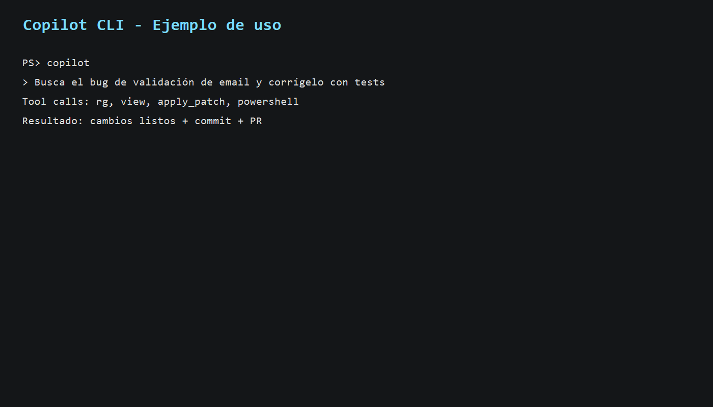
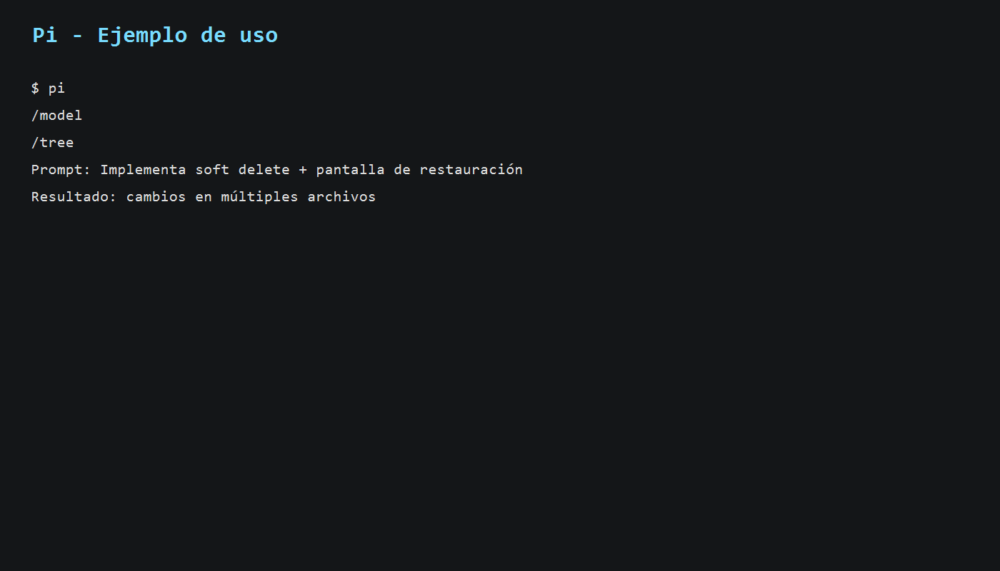
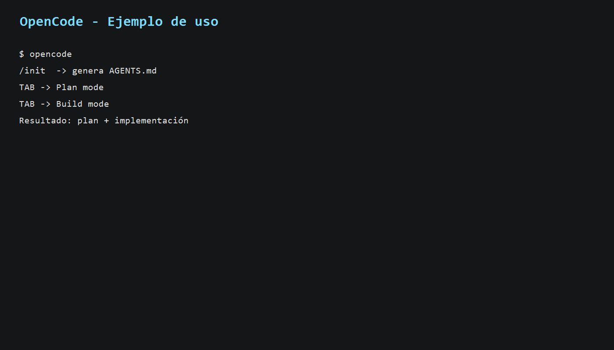
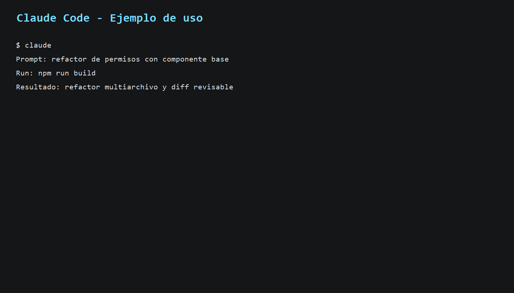

# Investigación: Agentic Development (2026)

## ¿Qué es el desarrollo agéntico?

El **desarrollo agéntico** es una forma de construir software donde un agente de IA no solo responde preguntas, sino que **planifica, ejecuta y verifica** tareas de ingeniería (leer código, editar archivos, correr comandos, crear PRs, etc.) con supervisión humana.  

En 2026, su aplicación práctica más común es:

1. El desarrollador define objetivo y restricciones.
2. El agente explora el repositorio y propone/ejecuta cambios.
3. El humano revisa diffs, riesgos y decisiones de arquitectura.
4. Se itera hasta integrar en CI/CD (commit, PR, merge).

---

## Herramientas investigadas

| Herramienta | Qué es | Enfoque |
|---|---|---|
| **Copilot CLI** | Asistente agéntico en terminal, integrado con GitHub | Flujo de trabajo completo en repos + issues/PR |
| **Pi** | Harness mínimo y extensible para agentes de código en terminal | Alta personalización (extensions/skills/prompts) |
| **OpenCode** | Agente open source para terminal/TUI y extensiones | Productividad rápida con comandos tipo `/init`, `/undo` |
| **Claude Code** | Agente de Anthropic para CLI/IDE/web/desktop | Ejecución end-to-end con contexto amplio de proyecto |

---

## Ejemplos prácticos de uso

### 1) Copilot CLI

**Caso:** corregir un bug y abrir PR desde terminal.

```bash
copilot
# Prompt:
# "Busca por qué falla la validación de email en registro y corrígelo con tests."
git add .
git commit -m "fix: corrige validación de email"
gh pr create --fill
```

**Resultado esperado:** cambios de código + commit + PR listos para revisión.

### 2) Pi

**Caso:** generar una feature con personalización por skills.

```bash
npm install -g @mariozechner/pi-coding-agent
pi
# En la sesión:
/model
/tree
# Prompt:
# "Agrega soft delete en notas y pantalla para restaurarlas."
```

**Resultado esperado:** cambios en backend/frontend + navegación por árbol de sesión.

### 3) OpenCode

**Caso:** planificar y luego implementar una mejora.

```bash
opencode
/init
# Tab (Plan mode)
# Prompt: "Agregar autenticación en /settings reutilizando /notes"
# Tab (Build mode)
```

**Resultado esperado:** AGENTS.md generado, plan explícito e implementación aplicada.

### 4) Claude Code

**Caso:** refactor multiarchivo con validación de build.

```bash
claude
# Prompt:
# "Refactoriza permisos compartiendo un componente base y deja build en verde."
```

**Resultado esperado:** refactor consistente, comandos de verificación y diff revisable.

---

## Agentes, skills y rules por herramienta

| Herramienta | Agentes | Skills | Rules / Instrucciones |
|---|---|---|---|
| **Copilot CLI** | Soporta agentes/subagentes y delegación (`/agent`, `/delegate`, `/fleet`) | Gestión explícita con `/skills`; extensible por MCP/plugins | Respeta archivos de instrucciones como `AGENTS.md`, `.github/copilot-instructions.md`, `CLAUDE.md`, etc. |
| **Pi** | Núcleo minimalista; subagentes y plan mode se agregan vía extensiones | Skills cargadas on-demand, empaquetables y compartibles | Usa `AGENTS.md` y `SYSTEM.md`; fuerte enfoque en “context engineering” |
| **OpenCode** | Configurable por perfiles de agente en config (`agents`) | Comandos y customización del flujo (plan/build, share, undo) | `/init` crea `AGENTS.md` para guiar estilo y decisiones del proyecto |
| **Claude Code** | Agente principal con ejecución en CLI/IDE/web + automatización en CI | Ecosistema con integraciones y Agent SDK para workflows custom | Uso intensivo de `CLAUDE.md` y settings persistentes por proyecto |

---

## Comparación de mejores opciones (2026)

| Criterio | Copilot CLI | Pi | OpenCode | Claude Code |
|---|---|---|---|---|
| Integración con GitHub | **Excelente** | Buena | Buena | Muy buena |
| Personalización profunda | Alta | **Muy alta** | Alta | Alta |
| Facilidad de inicio | **Muy alta** | Media | Alta | Alta |
| Ecosistema enterprise | **Muy fuerte** | Media | Media | Fuerte |
| Ideal para | Equipos ya centrados en GitHub | Power users que quieren control total | Flujo open source flexible en TUI | Desarrollo asistido integral multi-superficie |

**Conclusión breve:**

1. **Mejor opción general en entornos GitHub:** Copilot CLI.  
2. **Mejor para máxima extensibilidad del agente:** Pi.  
3. **Mejor alternativa open source terminal-first:** OpenCode.  
4. **Mejor experiencia integral (CLI + IDE + web + desktop):** Claude Code.

---

## Capturas de pantalla (uso de herramientas)

> Capturas generadas en terminal como evidencia de comandos, prompts y resultados esperados por herramienta.

### Copilot CLI



### Pi



### OpenCode



### Claude Code



---

## Fuentes

- Copilot CLI (README y documentación):  
  https://docs.github.com/en/copilot/github-copilot-in-the-cli  
  https://docs.github.com/copilot/concepts/agents/about-copilot-cli
- Claude Code overview:  
  https://docs.anthropic.com/en/docs/claude-code/overview
- OpenCode docs:  
  https://opencode.ai/docs
- Pi (sitio oficial + docs):  
  https://pi.dev  
  https://github.com/badlogic/pi-mono/tree/main/packages/coding-agent
