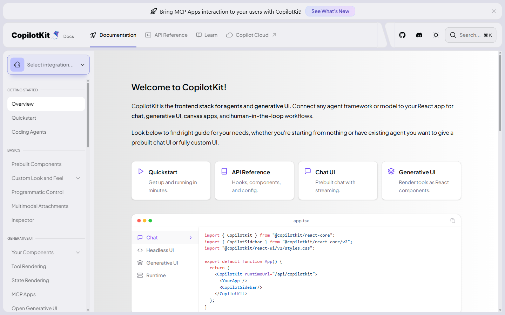
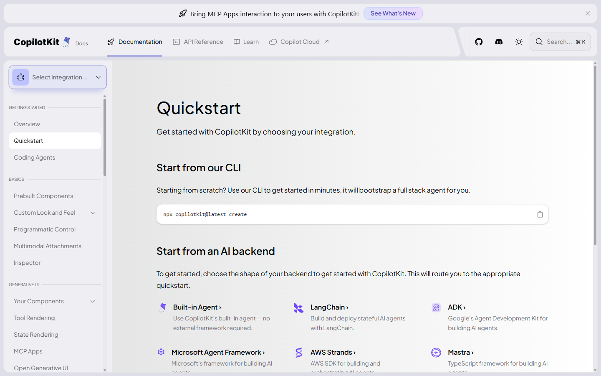
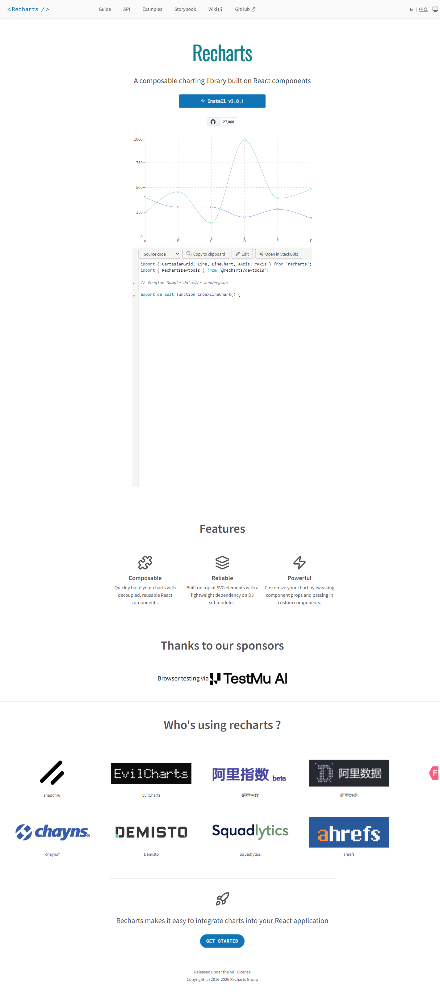
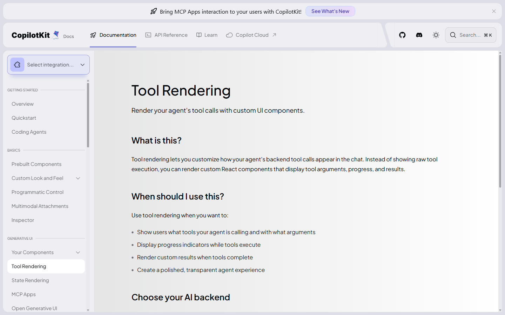
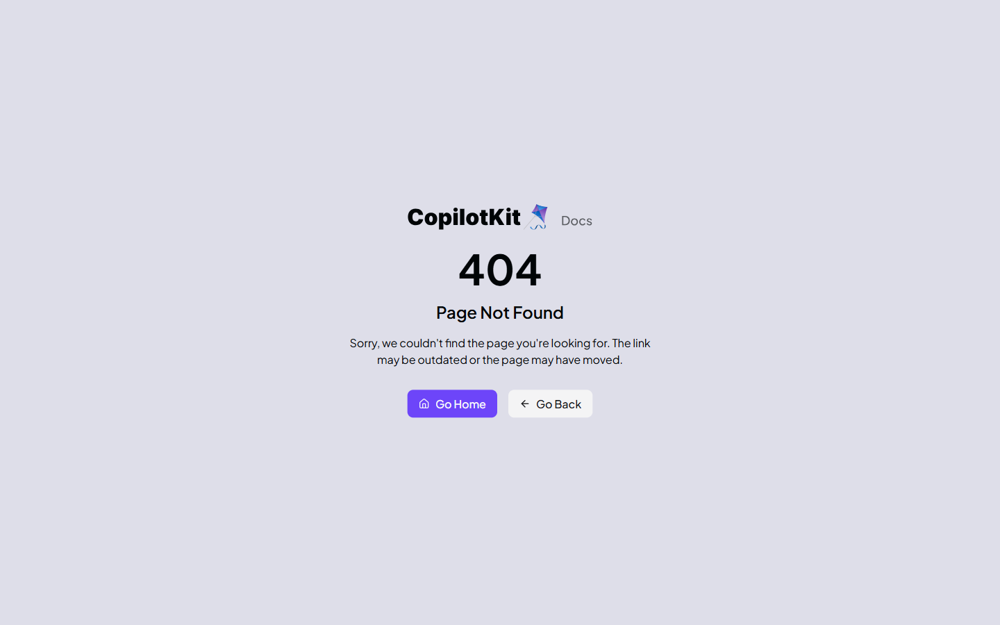

# Portada

**Materia:** Desarrollo de Software XI  
**Tema:** Interfaz web con IA: uso de CopilotKit para construir experiencias conversacionales, representar charts e inyectar componentes en frontend moderno  
**Integrantes del grupo:**  
1. Nicolas Athanasiadis  
2. Jack Garcia  
3. Angel del Biondo    
**Fecha:** 04 / 17 / 2026

---

# Contenido

## 1. Introducción

El desarrollo frontend ha cambiado de forma acelerada con la integración de inteligencia artificial (IA). Antes, una interfaz web se limitaba a mostrar formularios, tablas y botones que respondían a reglas estáticas. Hoy, las aplicaciones modernas pueden conversar con el usuario, interpretar intención, resumir datos, proponer acciones y adaptar la presentación visual en tiempo real. Esta evolución no reemplaza los principios clásicos de UX, arquitectura o accesibilidad; más bien, los vuelve más importantes. Cuando una interfaz incluye IA, también debe ser clara, confiable, auditable y controlable.

Una de las dudas más frecuentes al iniciar este tipo de proyectos es: “¿Cómo conecto una experiencia de IA con mi frontend sin construir todo desde cero?”. Aquí entra **CopilotKit** (a veces escrito como “copilottkit” por error), un framework que facilita crear asistentes de IA integrados en aplicaciones web, sobre todo en ecosistemas React/Next.js. Su propuesta central es combinar conversación natural con acciones concretas en la interfaz: leer estado del cliente, ejecutar funciones de negocio seguras, disparar flujos y renderizar componentes contextuales según lo que el usuario pide.

Este informe explica cómo se construye una interfaz web con IA actualmente, qué lugar ocupa CopilotKit dentro del stack, cómo puede representar gráficos (charts) y “inyectar” componentes, y cómo aplicarlo de forma práctica en un proyecto frontend real. También se abordan decisiones de arquitectura, seguridad, rendimiento, experiencia de usuario y mantenimiento para evitar implementaciones improvisadas.

## 2. ¿Qué significa hacer una interfaz web con IA?

Hacer una interfaz web con IA no es únicamente poner un chat flotante en la esquina. Significa diseñar un sistema de interacción donde el lenguaje natural se convierte en operaciones útiles para el usuario y en cambios visuales coherentes con el estado de la aplicación.

De forma práctica, una interfaz web con IA suele incorporar:

1. **Entrada natural**: el usuario escribe o habla una solicitud (“muéstrame las ventas del último trimestre por región”).
2. **Interpretación semántica**: un modelo de lenguaje (LLM) transforma la intención en una estructura accionable.
3. **Ejecución controlada**: la aplicación llama funciones permitidas (consultar API, filtrar dataset, crear borrador, etc.).
4. **Presentación enriquecida**: la UI devuelve texto, tablas, gráficos, tarjetas, estados de carga y acciones sugeridas.
5. **Memoria y contexto**: el asistente usa historial de conversación y estado del usuario para respuestas más relevantes.
6. **Gobernanza**: validaciones, permisos, trazabilidad y límites de costo/latencia.

### 2.1 Diferencia entre “UI tradicional” y “UI asistida por IA”

En UI tradicional, cada camino de interacción está prediseñado (“si presiona este botón, pasa esto”). En UI asistida por IA, el usuario puede recorrer caminos no anticipados y aún así esperar respuestas útiles. Eso obliga a trabajar con componentes más flexibles, desacoplados y observables.

### 2.2 Patrones de producto más comunes

- **Copiloto contextual**: asistente dentro de un módulo concreto (CRM, analytics, soporte, educación).
- **Asistente global de app**: conoce múltiples secciones y ayuda a navegar o ejecutar tareas transversales.
- **Generador de vistas**: crea filtros, paneles o reportes desde lenguaje natural.
- **Asistente operativo**: guía procesos paso a paso (onboarding, carga de datos, resolución de incidentes).

## 3. Arquitectura recomendada para frontend con IA

Una implementación robusta separa responsabilidades para no depender de “prompts mágicos” en el cliente. Una arquitectura base suele dividirse así:

### 3.1 Capa de presentación (Frontend)

- Componentes React/Vue/Svelte.
- Estado de UI (loading, errors, chat history, selected filters, theme, etc.).
- Render de respuestas: markdown, cards, charts, tablas.
- Acciones del usuario: enviar prompt, confirmar ejecución, deshacer cambios.

### 3.2 Capa de orquestación (Backend o edge functions)

- Autenticación y autorización.
- Selección de modelo y proveedor.
- Definición de herramientas/funciones permitidas.
- Validación de entradas y salidas.
- Logging, métricas y control de costos.

### 3.3 Capa de datos

- APIs internas/externas.
- Base de datos transaccional.
- Almacén analítico para reportes.
- Caché y colas para operaciones pesadas.

### 3.4 Capa de observabilidad

- Trazas por conversación (sin filtrar datos sensibles).
- Métricas de latencia y tokens.
- Errores por tipo (modelo, red, permisos, parseo).
- Evaluación de calidad de respuestas.

Esta separación permite evolucionar la IA sin romper la experiencia del usuario ni exponer secretos en el cliente.

## 4. Frameworks y herramientas para IA en frontend (visión actual)

Hoy existen varias opciones para agregar IA a interfaces web:

- **SDKs de proveedores de modelos** (OpenAI, Anthropic, etc.): gran flexibilidad, pero más trabajo de integración.
- **Frameworks de orquestación** (LangChain, LlamaIndex): útiles para flujos complejos, RAG y agentes.
- **UI kits conversacionales**: aceleran la experiencia visual y eventos del chat.
- **CopilotKit**: orientado a integrar copilotos dentro de apps frontend, conectando conversación con acciones UI.

CopilotKit destaca cuando el objetivo no es solo responder texto, sino permitir que el asistente interactúe con el estado de la aplicación y habilite componentes dinámicos según contexto.

## 5. ¿Qué es CopilotKit y por qué usarlo?

**CopilotKit** es un framework diseñado para construir copilotos y asistentes de IA en aplicaciones web modernas. Se integra principalmente con React y Next.js, y ofrece una base para:

1. Incorporar UI conversacional en el frontend.
2. Registrar acciones que el asistente puede invocar.
3. Compartir contexto de aplicación con el modelo.
4. Renderizar respuestas con componentes personalizados.
5. Conectar con distintos modelos/proveedores según necesidades del proyecto.

### 5.1 Ventajas principales

- **Integración rápida**: reduce el tiempo de pasar de “idea” a prototipo funcional.
- **Orientación a producto**: no se queda en prompt-response; habilita interacción con la app.
- **Composición con React**: se apoya en patrones conocidos (hooks, providers, props, estado).
- **Escalabilidad progresiva**: se puede iniciar simple y endurecer luego (auth, auditoría, guardrails).

### 5.2 Cuándo conviene usarlo

Conviene cuando se necesita un asistente dentro de una app que:

- Lea o modifique estado de interfaz de forma controlada.
- Dispare funciones reales (filtrar datos, crear entidades, navegar, sugerir acciones).
- Renderice elementos visuales (cards/charts/controles) según la conversación.

Si solo se requiere un “chat básico de texto”, puede bastar un SDK directo. Pero para una experiencia de copiloto en producto, CopilotKit suele acelerar bastante.

## 6. ¿Cómo ayuda CopilotKit a representar charts e inyectar componentes?

La idea clave es que el asistente no devuelva solo texto plano. También puede devolver **intenciones de UI** o estructuras de datos que el frontend convierte en componentes reales.

### 6.1 Representación de charts

Flujo típico:

1. Usuario: “Muéstrame un gráfico de barras de ventas por región”.
2. IA interpreta: tipo de gráfico = barras; métrica = ventas; dimensión = región.
3. Acción backend obtiene datos.
4. Frontend recibe payload normalizado (labels, series, título, filtros aplicados).
5. Se renderiza componente de chart (por ejemplo con Recharts, ECharts o Chart.js).

Esto evita respuestas ambiguas porque el “contrato” entre IA y UI está estructurado.

Ejemplo conceptual de payload:

```json
{
  "component": "BarChart",
  "title": "Ventas por región",
  "data": [
    { "region": "Norte", "ventas": 120000 },
    { "region": "Centro", "ventas": 98000 },
    { "region": "Sur", "ventas": 143000 }
  ],
  "xKey": "region",
  "yKey": "ventas"
}
```

### 6.2 Inyección de componentes

“Inyectar componentes” significa que, según el resultado de la conversación, la UI decide mostrar un componente específico: una tabla, una tarjeta de resumen, un modal de confirmación, un formulario prellenado o un chart.

Patrón recomendado:

- Definir un **catálogo de componentes permitidos** (whitelist).
- Mapear `component` -> React component.
- Validar schema antes de renderizar.
- Mostrar fallback seguro si el payload es inválido.

Con esto se evita que la IA “inventé” estructuras peligrosas o inservibles.

## 7. Implementación práctica de CopilotKit en un proyecto frontend actual

## 7.1 Escenario base

Supongamos una aplicación de dashboard comercial con React + Next.js. El objetivo es permitir que el usuario consulte métricas por chat y reciba visualizaciones dinámicas.

### 7.2 Pasos de implementación (visión general)

1. Crear proyecto frontend (Next.js o Vite + React).
2. Instalar CopilotKit y librerías de soporte.
3. Configurar proveedor de IA en backend seguro.
4. Definir acciones disponibles para el asistente.
5. Crear contratos de respuesta para componentes visuales.
6. Renderizar chat + panel de resultados.
7. Agregar manejo de errores, permisos y telemetría.

### 7.3 Estructura sugerida de carpetas

```txt
src/
  app/
    dashboard/
      page.tsx
  components/
    ai/
      CopilotPanel.tsx
      ResultRenderer.tsx
      charts/
        SalesBarChart.tsx
  lib/
    ai/
      actions.ts
      schemas.ts
      mappers.ts
  api/
    ai/
      route.ts
```

### 7.4 Ejemplo conceptual de integración en React

```tsx
import { CopilotKit } from "@copilotkit/react-core";
import { CopilotSidebar } from "@copilotkit/react-ui";
import { ResultRenderer } from "./ResultRenderer";

export default function DashboardPage() {
  return (
    <CopilotKit runtimeUrl="/api/ai">
      <main>
        <h1>Dashboard Comercial</h1>
        <ResultRenderer />
        <CopilotSidebar
          defaultOpen
          instructions="Ayuda al usuario a explorar métricas y generar visualizaciones."
        />
      </main>
    </CopilotKit>
  );
}
```

Nota: los nombres exactos de paquetes/componentes pueden variar según versión, por lo que siempre se recomienda validar con la documentación oficial.

### 7.5 Acciones registradas (tool/action calling)

Una buena práctica es declarar funciones acotadas:

- `getSalesByRegion(period)`
- `getTopProducts(limit)`
- `createComparisonChart(metric, groupBy, period)`

Cada acción debe incluir:

- Validación de parámetros.
- Control de permisos por rol de usuario.
- Límite de filas/tamaño de respuesta.
- Manejo de errores explícito.

### 7.6 Contratos con schema

Para que la IA no devuelva formatos inconsistentes, se puede usar validación de schema (por ejemplo Zod o JSON Schema).  
Si `component = "BarChart"`, entonces se exige `{ data, xKey, yKey }`.

Beneficios:

- Menos errores de render.
- Comportamiento predecible.
- Mantenibilidad del código.

### 7.7 Renderizador dinámico de componentes

Conceptualmente:

```tsx
const componentMap = {
  BarChart: SalesBarChart,
  SummaryCard: SummaryCard,
  DataTable: DataTable
};

export function ResultRenderer({ payload }) {
  const Component = componentMap[payload?.component];
  if (!Component) return <p>No se pudo renderizar el resultado.</p>;
  return <Component {...payload} />;
}
```

Esta estrategia permite que la IA “seleccione” vistas dentro de un conjunto seguro, sin ejecutar código arbitrario.

### 7.8 UX conversacional efectiva

Una interfaz con IA útil no depende solo del modelo; depende del diseño de interacción:

- Mostrar ejemplos de preguntas iniciales.
- Confirmar operaciones sensibles (“¿Deseas exportar este reporte?”).
- Permitir editar/reintentar prompts.
- Diferenciar claramente estados: generando, completado, error.
- Guardar historial relevante y opción de limpiar contexto.

## 8. Buenas prácticas actuales para usar CopilotKit en frontend

### 8.1 Seguridad y privacidad

- Nunca exponer API keys en el cliente.
- Filtrar datos sensibles en logs.
- Aplicar autorización por acción, no solo por ruta.
- Limitar operaciones mutables desde IA (crear/editar/eliminar) con confirmación.

### 8.2 Rendimiento

- Usar streaming cuando sea posible para mejorar percepción de velocidad.
- Implementar caché para consultas repetidas.
- Evitar payloads gigantes en respuestas del asistente.
- Dividir componentes pesados con lazy loading.

### 8.3 Calidad de respuestas

- Instrucciones del sistema claras y acotadas.
- Contexto relevante, no excesivo.
- Fallbacks cuando falte información.
- Métricas de evaluación: precisión, utilidad, tasa de reintento.

### 8.4 Mantenibilidad

- Separar prompts/instrucciones del código UI cuando aplique.
- Versionar contratos de salida del asistente.
- Documentar acciones y sus límites.
- Agregar tests de integración para flujos críticos.

## 9. Ejemplo aplicado: de pregunta natural a visualización en pantalla

Caso de uso: una jefatura comercial necesita revisar caída de ventas.

1. Usuario pregunta: “Compara ventas mensuales del Q1 con Q2 y muéstralo en gráfico”.
2. Copilot identifica métrica, periodos y visual recomendada (líneas).
3. Ejecuta acción `getSalesComparison(Q1, Q2, monthly)`.
4. Backend responde dataset normalizado.
5. Copilot devuelve payload para `LineChart`.
6. Frontend renderiza gráfico y resumen textual.
7. Usuario solicita “filtra solo región Norte”.
8. Se aplica filtro en nueva acción y se actualiza componente.

Resultado: el usuario logra análisis iterativo sin navegar múltiples pantallas ni construir reportes manuales.

## 10. Capturas de pantalla (según aplique)

> Reemplazar las siguientes imágenes con evidencia real del proyecto (instalación, ejecución y resultados).

### 10.1 Estructura del proyecto con módulo de IA



### 10.2 Interfaz del copilot en ejecución



### 10.3 Respuesta con chart dinámico



### 10.4 Inyección de componente (tabla/tarjeta)



### 10.5 Manejo de error y fallback visual



## 11. Retos frecuentes y cómo mitigarlos

### 11.1 “La IA responde bonito, pero no útil”

Causa: falta de acciones de negocio bien definidas.  
Mitigación: diseñar herramientas concretas y salidas estructuradas.

### 11.2 “El modelo inventa datos”

Causa: prompts abiertos sin grounding.  
Mitigación: forzar uso de acciones para datos reales y bloquear respuestas sin fuente.

### 11.3 “Demasiada latencia”

Causa: prompts extensos + consultas pesadas + render bloqueante.  
Mitigación: streaming, caché, límites de contexto y optimización de consultas.

### 11.4 “Difícil de mantener”

Causa: mezcla de UI, prompts y lógica en un solo archivo.  
Mitigación: modularizar capas (acciones, schemas, render, estado, backend).

## 12. Tendencias actuales (2026) en interfaces web con IA

1. **Copilotos especializados por dominio**: en vez de un asistente genérico, se construyen copilotos de finanzas, soporte, legal o educación con herramientas específicas.
2. **UI multimodal**: texto + voz + imagen en la misma experiencia frontend.
3. **Componentes generativos controlados**: la IA sugiere estructura visual, pero el frontend la valida y restringe.
4. **Mayor observabilidad**: trazabilidad por conversación para cumplir requisitos de calidad y compliance.
5. **Agentes con memoria de trabajo temporal**: recuerdan pasos de una tarea sin invadir privacidad de largo plazo.

CopilotKit encaja bien en estas tendencias porque prioriza la conexión entre conversación y acciones reales de interfaz.

## 13. Conclusión técnica del contenido

Construir una interfaz web con IA hoy implica diseñar tanto interacción como ingeniería de software: contratos, estados, seguridad, observabilidad y experiencia de usuario. No se trata de “pegar un modelo” al frontend, sino de crear un sistema confiable que traduzca lenguaje natural en resultados útiles y verificables.

En ese contexto, CopilotKit es una opción práctica para equipos frontend que trabajan con React/Next.js y necesitan un copiloto integrado al producto. Su fortaleza está en permitir que la IA no solo hable, sino que actúe con límites claros sobre la aplicación: consultar datos, sugerir operaciones, mostrar charts e inyectar componentes de forma controlada.

Implementado con buenas prácticas (acciones validadas, schemas, permisos, fallback y métricas), CopilotKit puede reducir fricción de uso, acelerar análisis de información y mejorar productividad del usuario final. Implementado sin disciplina, puede crear deuda técnica y riesgos de seguridad. Por eso, el éxito no depende solo del framework, sino de la arquitectura y la gobernanza del proyecto.

Además, para mantener resultados sostenibles en producción, se recomienda incorporar ciclos continuos de mejora: revisión de conversaciones reales, ajustes de instrucciones del asistente, pruebas de regresión sobre acciones críticas y monitoreo de satisfacción de usuarios internos o clientes finales.

---

# Conclusiones individuales

## Integrante 1

**Nombre:** Nicolas Athanasiadis  
**Conclusión personal:**  

Esta investigación me permitió entender que una interfaz con IA no se trata solo de agregar un chat, sino de diseñar contratos claros entre conversación, datos y componentes visuales. Considero que CopilotKit aporta valor cuando se usa con acciones validadas, schemas y control de permisos. El mayor aprendizaje fue que la calidad técnica de la arquitectura define si la experiencia asistida realmente ayuda al usuario.

## Integrante 2

**Nombre:** Jack Garcia  
**Conclusión personal:**  

Concluyo que integrar IA en frontend exige priorizar experiencia de usuario y claridad en la interacción, especialmente en estados de carga, errores y confirmaciones. La capacidad de renderizar charts y componentes dinámicos mejora mucho la toma de decisiones cuando los datos están bien estructurados. También vi que sin observabilidad y métricas, es difícil sostener una solución de IA en producción.

## Integrante 3

**Nombre:** Angel del Biondo  
**Conclusión personal:**  

Para mí, el punto más importante fue comprender que la seguridad y la gobernanza son tan relevantes como el modelo de IA. CopilotKit facilita acelerar el desarrollo, pero su uso debe acompañarse de límites técnicos para evitar respuestas inconsistentes o acciones riesgosas. Esta investigación demuestra que una implementación modular y mantenible es clave para escalar asistentes dentro de aplicaciones reales.

---

# Bibliografía (APA 7ma edición)

Anthropic. (2026). *Claude documentation*. https://docs.anthropic.com/

CopilotKit. (2026). *CopilotKit documentation*. https://docs.copilotkit.ai/

GitHub. (2026). *GitHub Copilot documentation*. https://docs.github.com/copilot

MDN Web Docs. (2026). *Web performance and accessibility*. https://developer.mozilla.org/

Next.js. (2026). *Next.js documentation*. https://nextjs.org/docs

OpenAI. (2026). *API documentation*. https://platform.openai.com/docs

React. (2026). *React documentation*. https://react.dev/

Recharts. (2026). *Recharts documentation*. https://recharts.org/

W3C. (2026). *Web Content Accessibility Guidelines (WCAG) overview*. https://www.w3.org/WAI/standards-guidelines/wcag/
