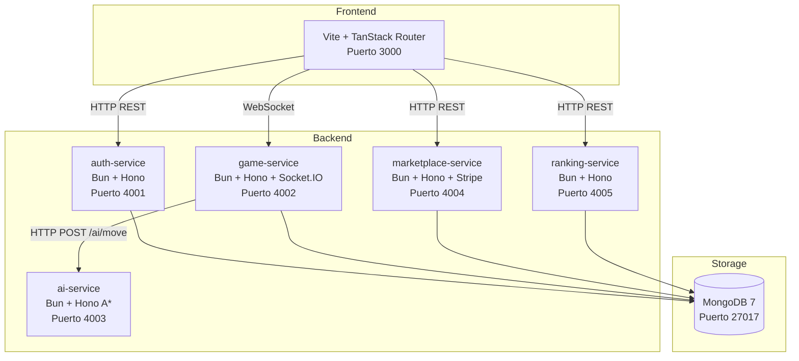
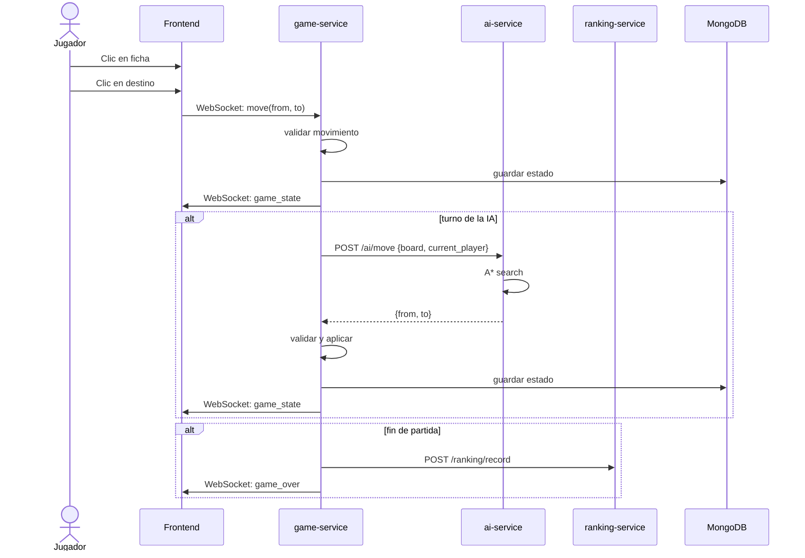
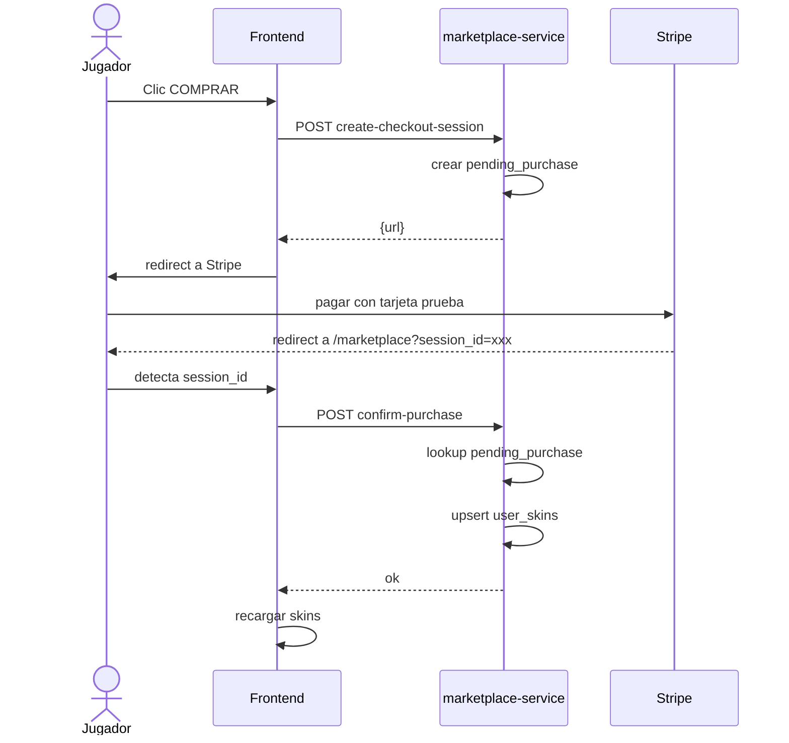

# DAMAS // Juego de Damas con IA A*

Proyecto individual de un juego de Damas (checkers) donde el jugador compite contra la computadora con IA basada en el algoritmo A*.

## Variante elegida

**Damas Inglesas/Americanas** (8×8):
- Tablero 8×8, piezas en casillas oscuras.
- Peones mueven diagonal hacia adelante una casilla; capturas saltan sobre pieza enemiga.
- Captura **obligatoria** (regla inglesa estándar).
- **Multi-salto**: si tras capturar la misma pieza puede seguir capturando, debe continuar; cuenta como un solo movimiento para el ranking.
- Coronación al llegar al extremo opuesto → "dama" (rey) que mueve en las cuatro diagonales. Coronar durante una captura termina el turno.
- Pierde quien se queda sin piezas o sin movimientos legales.

## Stack tecnológico

| Componente | Tecnología |
|---|---|
| Frontend | Vite + TanStack Router + React 19 + TypeScript |
| Backend (servicios) | Bun + Hono |
| Base de datos | MongoDB 7 |
| IA | Algoritmo A* (Bun) |
| Pagos | Stripe (modo prueba) |
| Autenticación | JWT + bcrypt (servicio propio) |
| Contenedores | Docker / Docker Compose |

## Arquitectura



### Flujo de datos durante una partida vs IA



### Flujo de pago (Stripe)



> **Nota sobre TanStack**: Se usa Vite + TanStack Router (no TanStack Start) por compatibilidad de versiones. TanStack Router v1.170+ es la biblioteca de routing subyacente que Start también utiliza.

## Cómo ejecutar

### Con Docker (recomendado)

```bash
# Clonar el repositorio
cd proyecto-damas

# Configurar variables de entorno
# Editar .env con tus claves de Stripe (modo prueba)

# Iniciar todos los servicios
docker compose up --build
```

Abrir http://localhost:3000.

### Sin Docker (desarrollo local)

Requiere Bun 1.3+ y MongoDB 7 corriendo en localhost:27017.

```bash
# Terminal 1 - Auth service
cd auth-service && bun install && bun run dev

# Terminal 2 - Game service
cd game-service && bun install && bun run dev

# Terminal 3 - AI service
cd ai-service && bun install && bun run dev

# Terminal 4 - Ranking service
cd ranking-service && bun install && bun run dev

# Terminal 5 - Marketplace service
cd marketplace-service && bun install && bun run dev

# Terminal 6 - Frontend
cd frontend && bun install && bun run dev
```

## Demo paso a paso (presentación)

Sigue esta secuencia durante la presentación en clase:

### 1. Iniciar servicios

```bash
docker compose up --build
```

Esperar a que todos los servicios muestren "listening on :XXXX" (unos 15-20 segundos).

Verificar health checks:

```bash
curl -s http://localhost:4001/health && echo ""
curl -s http://localhost:4002/health && echo ""
curl -s http://localhost:4003/health && echo ""
curl -s http://localhost:4004/health && echo ""
curl -s http://localhost:4005/health && echo ""
```

### 2. Abrir frontend

Navegar a http://localhost:3000. La app redirige a `/login`.

### 3. Registrarse

Hacer clic en "Regístrate" o ir a `/sign-up`. Crear usuario (ej: `jugador1`, `jugador1@test.com`, `test1234`).

### 4. Jugar vs IA

En el lobby, hacer clic en "EMPEZAR AHORA" (modo IA). Esperar a que la IA mueva (tarda ~2-3s desde la posición inicial). Jugar algunas movidas. Al terminar la partida, aparece el overlay de fin de juego con opción de ver el ranking.

### 5. Ver ranking

Ir a `/ranking`. Aparecen las partidas ganadas ordenadas por menor cantidad de movimientos.

### 6. Marketplace

Ir a `/marketplace`. Explorar skins gratuitas y premium. Las gratuitas se obtienen al instante. Las premium redirigen a Stripe Checkout (modo prueba — usar `4242 4242 4242 4242` como número de tarjeta).

## Cómo se invoca el microservicio A*

El `ai-service` expone un endpoint HTTP `POST /ai/move` que recibe:

```json
{
  "board": [["", "b", "", ...], ...],
  "current_player": "black",
  "must_continue_from": null
}
```

Y devuelve:

```json
{
  "from": [2, 3],
  "to": [4, 5]
}
```

El `game-service` llama a este endpoint cuando es el turno de la IA (negra). El algoritmo A* explora el árbol de estados usando una cola de prioridad (priority queue) ordenada por `f(n) = g(n) + h(n)` donde:
- `g(n)` = profundidad desde el estado inicial (costo acumulado, 1 por movimiento)
- `h(n)` = heurística = material propio - material del rival + bonus por avance + bonus por coronación
- El algoritmo expande el nodo con menor `f(n)` primero hasta encontrar la mejor jugada

Es A* puro: sin minimax, sin alpha-beta, sin Monte Carlo. Por limitaciones prácticas de rendimiento, se implementó un máximo de 5000 iteraciones; si se agota, se elige el mejor nodo visitado por heurística. Sin este límite, el espacio de búsqueda en posiciones con muchas piezas crece exponencialmente.

## Endpoints

| Servicio | Métodos |
|---|---|
| auth | `POST /auth/register`, `POST /auth/login`, `GET /auth/me`, `PATCH /auth/me/active-skin` |
| game (REST) | `POST /game`, `GET /game/:id`, `POST /game/:id/join` |
| game (WS) | `join_game`, `move`, `game_state`, `game_over` (Socket.IO) |
| ai | `POST /ai/move` |
| marketplace | `GET /marketplace/items`, `GET /marketplace/user/:userId/items`, `PATCH /marketplace/user/active-skin`, `POST /marketplace/create-checkout-session` |
| ranking | `POST /ranking/record`, `GET /ranking?limit=N` |

Todos los servicios exponen `GET /health`.

## Tests

### Tests unitarios (motor de damas y A*)

```bash
# Game engine (30 tests: movimientos, capturas, multi-captura, reyes, coronación, fin de partida)
cd game-service && bun test

# AI search (9 tests: movimientos legales, capturas, multi-salto, reyes, sin movimientos)
cd ai-service && bun test
```

### Tests end-to-end con Playwright

```bash
# Requiere todos los servicios corriendo via docker compose up
cd frontend && bunx playwright test
```

Actualmente los tests E2E cubren (14 tests): health checks de todos los servicios, flujo de registro/inicio de sesión, creación de partidas vía API, carga de la página de login, redirección cuando no hay sesión, y gameplay básico (crear partida vs IA, cargar tablero, realizar un movimiento y verificar actualización).

## Troubleshooting

| Problema | Posible causa | Solución |
|---|---|---|
| `docker compose up` falla | Puerto 3000, 4001-4005 o 27017 en uso | Detener otros contenedores: `docker compose down` |
| Stripe no redirige bien | `FRONTEND_URL` incorrecto en `.env` | Debe ser `http://localhost:3000` |
| Compra no se confirma | Token JWT inválido o `'exists'` | Limpiar localStorage y reiniciar sesión |
| IA no responde | `ai-service` no arrancó | Verificar `docker compose logs ai-service` |
| WebSocket no conecta | `VITE_GAME_URL` incorrecto | En Docker debe ser `http://localhost:4002` |
| Las skins no se aplican | `activeSkinId` no está seteado | Ir a Marketplace y activar una skin |
| Error de MongoDB | Servicio no saludable | `docker compose restart mongodb` |

## Limitaciones conocidas

- El A* implementa un máximo de 5000 iteraciones; en posiciones con muchas piezas puede no explorar todo el árbol, eligiendo la mejor jugada visitada.
- Stripe está en modo prueba: no se realizan cobros reales.
- El ranking solo registra victorias humanas, no derrotas (ordenado por menor cantidad de movimientos).
- El frontend tiene una copia del motor de damas solo para resaltar movimientos válidos visualmente; toda la validación real ocurre en el backend.
- Existe código Python (FastAPI) en `ai-service/app/` con una implementación alternativa de minimax con alpha-beta que no está conectada al sistema; la implementación activa es TypeScript con Bun.

## Rúbrica de evaluación

| Criterio | Puntos |
|---|---|
| Motor de damas y validación backend | 20 pts |
| Microservicio IA en Bun con A* puro | 25 pts |
| Login y ranking | 15 pts |
| Pago en línea | 15 pts |
| Tests | 10 pts |
| Documentación, Docker y demo | 15 pts |
| **Total** | **100 pts** |
